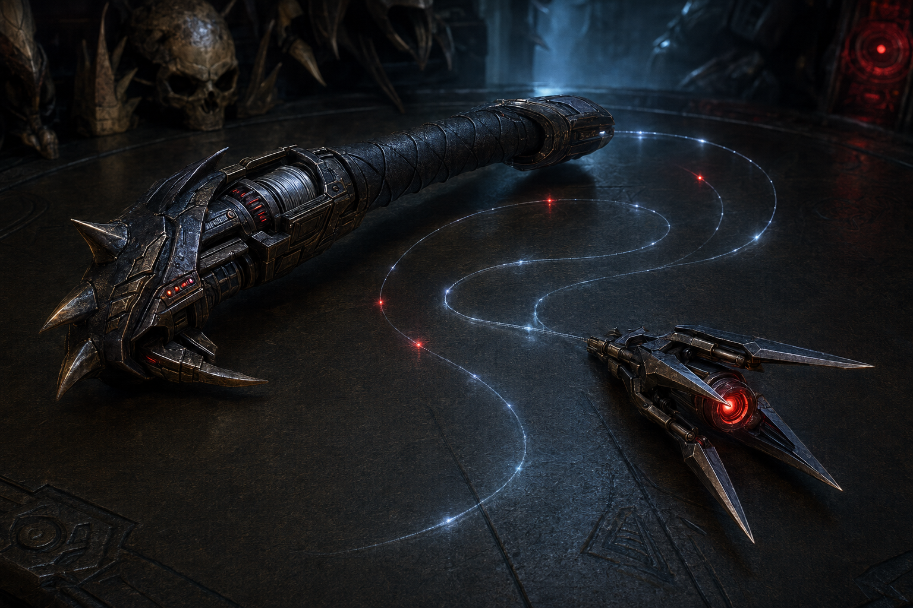
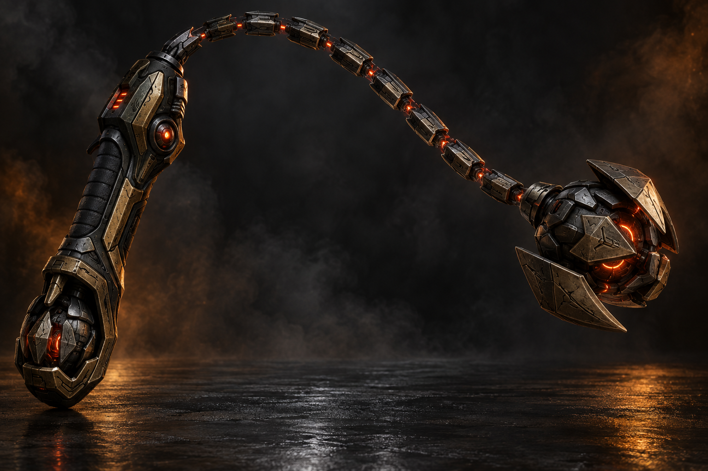
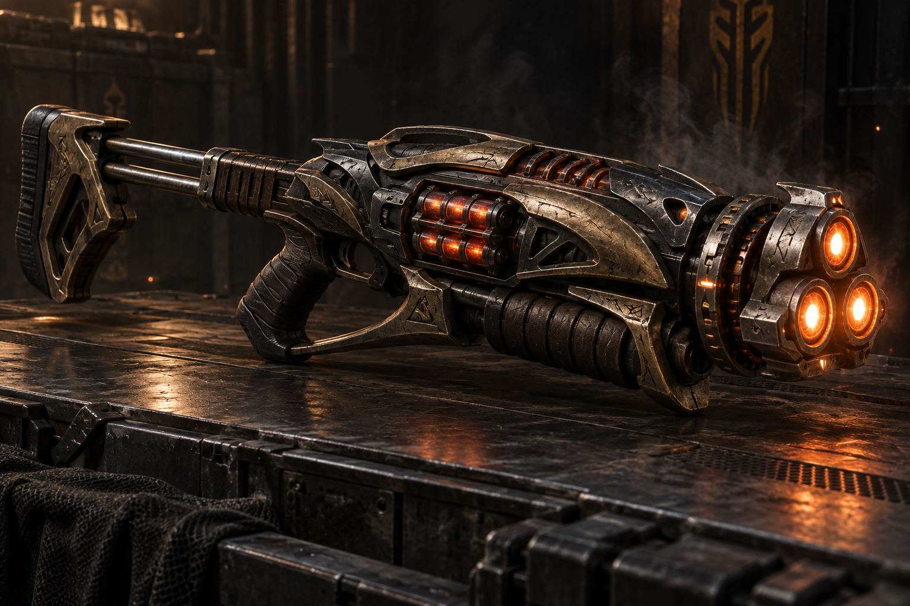
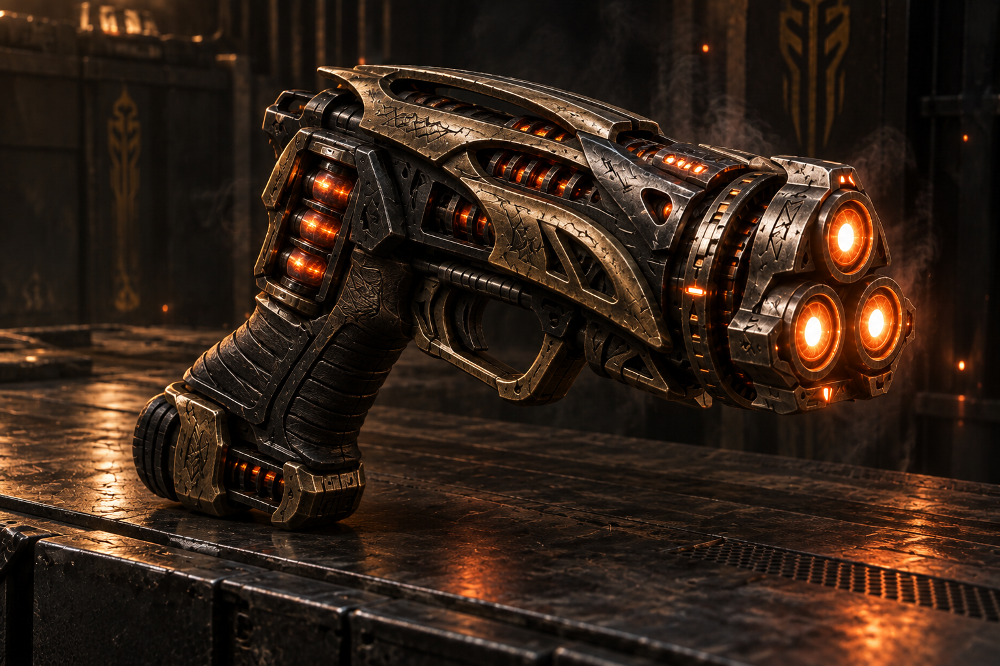

# Yautja Weapons

## Table of Contents

- [Hunter's Orbit](#hunters-orbit)
  - [Weapon Statistics](#weapon-statistics)
  - [Smart Guidance](#smart-guidance)
  - [Variable Reach](#variable-reach)
  - [Standard Functions](#standard-functions)
  - [Programmed Combat Functions](#programmed-combat-functions)
  - [Elite Functions](#elite-functions)
  - [Durability](#durability)
  - [Limitations](#limitations)
- [Tri-Fang](#tri-fang)
  - [Tri-Fang Statistics](#tri-fang-statistics)
  - [Tri-Fang Modes](#tri-fang-modes)
  - [Butt-Pump Cycling System](#butt-pump-cycling-system)
  - [Additional Functions](#additional-functions)
  - [Heat Limitations](#heat-limitations)
  - [Electrical Disruption](#electrical-disruption)
  - [Durability](#durability-1)
  - [Untrained Use](#untrained-use)
  - [Tactical Identity](#tactical-identity)
- [Tri-Talon](#tri-talon)
  - [Tri-Talon Statistics](#tri-talon-statistics)
  - [Tri-Talon Modes](#tri-talon-modes)
  - [Triad Lock](#triad-lock)
  - [Heel-Pump Cycling System](#heel-pump-cycling-system)
  - [Additional Functions](#additional-functions-1)
  - [Heat Limitations](#heat-limitations-1)
  - [Electrical Disruption](#electrical-disruption-1)
  - [Durability](#durability-2)
  - [Untrained Use](#untrained-use-1)
  - [Tri-Fang Weapon Family](#tri-fang-weapon-family)

---

## Hunter's Coil

The **Hunter's Coil** or *Yautja smart-lash* is a pred-tech weapon combining a retractable monofilament lash, magnetic grapnel, autonomous targeting system, and deployable restraint trap.

The weapon has two reinforced ends:

- A magnetized pred-tech spike at the end of the monofilament line.
- A spiked anchor pommel that can be driven into metal, stone, wood, or packed earth.

When inactive, the monofilament retracts into a compact forearm-mounted or belt-mounted housing. A bio-mask or wrist computer can program the weapon's path, select targets, regulate cable tension, and prevent the line from striking its wielder.

### Hunter's Coil Statistics

| Property | Statistics |
|---|---|
| Weapon Name | Hunter's Coil |
| Weapon Category | Smart-lash |
| Weapon Type | Exotic melee weapon |
| Size | Medium |
| Damage | 1d8 |
| Critical | 19–20/x2 |
| Damage Type | Slashing or piercing |
| Reach | 15 ft. |
| Weight | 5 lb. |
| Technology Level | Yautja advanced technology |
| Rank Access | Young-Blooded |
| Advanced Functions | Blooded or Elite rank |
| Proficiency | Exotic Melee Weapon Proficiency (Smart-Lash) |

A Hunter's Coil threatens squares within 10 feet but does not normally threaten adjacent squares.

Because of the weapon's onboard guidance system, the wielder may use either their **Strength modifier** or **Dexterity modifier** for attack rolls made with the Hunter's Coil.

---

### Standard Functions

#### Monofilament Lash

The Hunter's Coil uses a nearly invisible monofilament line capable of cutting through flesh, clothing, light armor, and fragile materials.

Against unattended objects, the Hunter's Coil ignores the first **5 points of hardness**.

This ability does not automatically bypass a creature's Damage Reduction. Armor specifically designed to resist monofilament weapons may reduce or negate this benefit.

#### Magnetic Spike

The tip of the Hunter's Coil contains an adjustable magnetic and molecular-adhesion system.

The spike can attach to:

- Metal weapons
- Armor
- Vehicles
- Ship hulls
- Industrial machinery
- Metal ceilings or walls
- Yautja equipment
- Other Hunter's Coils

Attaching the spike to an unattended metallic surface within 30 feet requires a ranged attack against **Defense 10**. Attaching the spike to a held, worn, or moving object requires a normal attack roll against the target.

The magnetic attachment can support up to **1,000 pounds** before automatically releasing. The wielder may increase, reduce, or deactivate the magnetic force through a wrist computer.

#### Magnetic Disarm

When attempting to disarm a creature wielding a metallic weapon, the Hunter's Coil grants a **+4 equipment bonus** on the opposed attack roll.

If the disarm attempt succeeds by 5 or more, the wielder may choose to:

- Pull the weapon into their hand.
- Attach the weapon to the Hunter's Coil's magnetic spike.
- Throw the weapon up to 10 feet away.
- Attach the weapon to a nearby metallic surface.

This bonus does not apply against nonmetallic weapons.

#### Entangling Strike

The wielder may attempt to wrap the Hunter's Coil around a target rather than dealing damage.

Make an attack roll with a **–2 penalty**. On a successful hit, a Large or smaller creature becomes **entangled**.

An entangled creature suffers the following penalties:

- –2 penalty on attack rolls.
- –4 penalty to Dexterity.
- Movement reduced by half.
- Cannot charge or run.

The target may escape by succeeding on one of the following checks:

- **Escape Artist:** DC 16
- **Strength:** DC 18

Attempting to escape requires an attack action. The wielder may release an entangled creature as a free action. A standard Hunter's Coil can restrain only one creature at a time.

#### Trip

The Hunter's Coil may be used to make trip attacks.

If the wielder fails the opposed check, they may release the line to avoid being tripped in return. The cable automatically retracts at the beginning of the wielder's next turn.

---

### Grappling and Mobility Functions

#### Grapnel Mode

The magnetic spike may be fired at a suitable surface within 30 feet and used as a grappling line.

Attaching the spike to a stable surface is normally a move action. Small, distant, unstable, or moving attachment points may require an attack roll.

While using the Hunter's Coil as a grapnel, the wielder gains:

- +4 equipment bonus on Climb checks.
- May ascend up to half their speed as a move action.
- May descend at their normal speed.
- May use the Coil to arrest a fall.

A falling wielder may attempt to fire and secure the Hunter's Coil as a reaction. This requires a suitable attachment point within 30 feet, a successful **Reflex save (DC 15)**, and an attack roll if the attachment point is especially small or difficult to strike.

#### Swinging Tether

When attached to a secure overhead surface, the Hunter's Coil may be used to swing across gaps or elevated terrain.

The wielder may move up to their base speed without making a check under normal circumstances. Difficult angles, moving anchor points, extreme distances, or unstable terrain may require a Jump, Tumble, or Climb check.

A creature swinging into an opponent may make a charge attack. On a successful hit, the attack deals an additional **1d6 points of damage** from momentum.

#### Emergency Tether

As a reaction, the wielder may attempt to attach the Hunter's Coil to:

- A falling ally.
- A fleeing creature.
- A departing vehicle.
- A closing door.
- A weapon knocked from their hand.
- A creature moving beyond the Coil's reach.

This requires an attack roll against the target's Defense. A willing creature or unattended object has **Defense 10** for this purpose.

---

### Blooded Pattern

At Blooded rank, the Hunter's Coil may be linked directly to a Yautja bio-mask or wrist computer. This transforms the weapon from a guided monofilament lash into a fully programmable smart weapon.

#### Target Marking

As a move action, the wielder may mark one creature, object, weapon, or visible body location within 30 feet.

The next Hunter's Coil attack made against the marked target gains a **+2 equipment bonus**.

The mark remains active until the wielder attacks the marked target, the target leaves the bio-mask's sensor range, the wielder marks another target, or the wielder dismisses the mark.

A marked target may be tracked through smoke, darkness, partial concealment, or visual camouflage, provided the wielder's bio-mask can still detect the target.

#### Programmed Strike

As a full-round action, the wielder may program a flight path against up to three marked targets within the Hunter's Coil's effective reach.

The wielder makes one attack roll against each target. All attacks made during the Programmed Strike suffer a **–2 penalty**.

The Hunter's Coil may be programmed to:

- Strike multiple enemies.
- Wrap around cover.
- Attack a target behind another creature.
- Strike an exposed limb.
- Target a held weapon.
- Attach the magnetic spike to armor or equipment.
- Return to the wielder after completing its programmed path.

The Hunter's Coil cannot normally attack the same target more than once during a Programmed Strike. When using optional called-shot rules, the wielder may mark and attack multiple distinct portions of the same target.

#### Guided Disarm

The wielder may mark a metallic weapon, shield, firearm, or piece of equipment instead of marking the creature carrying it.

A disarm attempt against a marked object gains a **+6 equipment bonus**, replacing the Hunter's Coil's normal +4 equipment bonus.

On a successful disarm attempt, the wielder may choose to:

- Pull the object into their hand.
- Pull the object away from the target.
- Throw the object up to 15 feet in a chosen direction.
- Attach the object to a nearby metallic surface.
- Bind the object against the target's body.

---

### Elite Pattern

Elite Yautja may use the Hunter's Coil as an autonomous weapon and deployable hunting trap.

#### Deploy Snare

Deploying the Hunter's Coil as a trap requires a full-round action.

The wielder drives the spiked pommel into a suitable surface and programs an activation zone with a radius of up to **15 feet**. The magnetic tip and monofilament line remain concealed until the trap activates.

The wielder may program the snare to respond to:

- Any creature entering the activation area.
- A specific species.
- A marked individual.
- A particular heat signature.
- Armed creatures.
- Creatures above a chosen size.
- Creatures moving toward or away from a location.
- Creatures crossing a designated path.

The trap may be programmed to ignore the wielder and designated allies.

#### Autonomous Lash

When a valid target enters the activation zone, the Hunter's Coil makes an autonomous attack.

> **Attack Bonus:** Wielder's base attack bonus + wielder's Dexterity modifier + 2 equipment bonus

On a successful hit, the trap may either deal **1d8 points of slashing damage** or entangle the target.

A creature entangled by an autonomous Hunter's Coil may escape with **Escape Artist (DC 18)** or **Strength (DC 20)**. The trap may make one autonomous attack each round.

#### Restricting Coil

If the Autonomous Lash attack exceeds the target's Defense by 5 or more, the target becomes **restrained** rather than entangled.

A restrained creature:

- Cannot move from its square.
- Loses its Dexterity bonus to Defense.
- Suffers a –4 penalty on attack rolls.
- Cannot use two-handed weapons.
- Must escape, disable, or destroy the Hunter's Coil before moving.

The Hunter's Coil may be programmed to tighten around armor or limbs without cutting into the target, allowing prey to be captured alive.

The wielder may instead activate lethal tension. A creature held by lethal tension suffers **1d6 points of slashing damage** at the beginning of each of its turns.

Activating lethal tension is considered an intentional killing action for the purposes of the Yautja Code of Honor.

#### Deployed Trap Statistics

| Property | Value |
|---|---:|
| Defense | 15 |
| Hardness | 10 |
| Hit Points | 20 |
| Detection DC | 22 |
| Disable Device DC | 25 |
| Activation Radius | 15 ft. |
| Maximum Active Duration | 8 hours |

The trap shuts down if its anchor pommel is removed, disabled, or destroyed.

---

### Smart-Lash Array

An Elite Yautja may link multiple Hunter's Coils into a coordinated trap network.

#### Linked Perimeter

Two or more deployed Hunter's Coils within 30 feet of one another may share targeting data.

The linked weapons may form:

- A perimeter alarm.
- A monofilament trip line.
- A crossing field.
- A capture corridor.
- A suspended restraint net.
- A multi-angle ambush.
- A containment cage.

Each Hunter's Coil added beyond the first provides one of the following benefits:

- +2 to escape DCs, to a maximum of +6.
- One additional restrained target.
- +5 feet to the activation radius.
- One additional autonomous attack each round.
- One concealed connecting line between two anchors.

The wielder chooses the benefit provided by each additional Hunter's Coil when the array is deployed.

#### Monofilament Crossing Field

Two Hunter's Coils may stretch a nearly invisible monofilament line between their anchor points.

A creature crossing the line must succeed on a **Reflex save (DC 18)** or suffer **2d6 points of slashing damage** and fall prone. A creature moving faster than its normal speed suffers **3d6 points of slashing damage** instead.

The line may alternatively be configured as a harmless sensor line. In this configuration, it marks the creature without dealing damage.

#### Capture Web

Three or more Hunter's Coils may coordinate to capture a creature from multiple directions.

When the Capture Web activates, make one autonomous attack for each deployed Hunter's Coil, to a maximum of four attacks.

- If at least two attacks hit, the target becomes restrained.
- If at least three attacks hit, the target becomes pinned.

A pinned target cannot move and may only attack with natural weapons, an unarmed strike, or a concealed light weapon.

---

### Pack Leader Pattern

A Pack Leader may integrate deployed Hunter's Coils into the pack's shared tactical network.

#### Shared Marks

Any allied Yautja connected to the Pack Leader's communication network may mark targets for a deployed Hunter's Coil.

A connected pack member may use a move action to command a Hunter's Coil to:

- Change targets.
- Release a captive.
- Tighten its restraint.
- Switch between capture and lethal modes.
- Retract its monofilament line.
- Relocate its magnetic spike.
- Trigger immediately.
- Deactivate and conceal itself.

#### Coordinated Hunt

When a Hunter's Coil restrains the Pack Leader's Marked Prey, allied Yautja gain a **+1 morale bonus on attack rolls and damage rolls** against that creature.

This replaces the normal attack bonus granted by Pack Command and does not stack with it.

---

### Weapon Limitations

#### Monofilament Hazard

The Hunter's Coil requires specialized training.

A character without **Exotic Melee Weapon Proficiency (Smart-Lash)** suffers the normal –4 nonproficiency penalty on attack rolls.

Whenever an untrained wielder rolls a natural 1 on an attack roll with the Hunter's Coil, they must succeed on a **Reflex save (DC 15)** or become entangled by the weapon.

#### Electrical Disruption

A successful electromagnetic pulse attack or similar electrical disruption disables the following systems for **1d4 rounds**:

- Smart targeting.
- Target marking.
- Autonomous trap functions.
- Magnetic attachment.
- Bio-mask synchronization.

The Hunter's Coil may still be used as a conventional monofilament whip during this time.

#### Monofilament Vulnerability

The monofilament line is exceptionally difficult to see but may be severed by specialized weapons.

| Property | Value |
|---|---:|
| Defense | 20 |
| Hardness | 12 |
| Hit Points | 10 |

An attacker must first detect or locate the line before targeting it.

#### Honor Considerations

Traditional Yautja clans may regard unattended lethal traps as dishonorable unless one or more of the following conditions apply:

- The prey knows it is being hunted.
- The trap is intended to test or capture rather than execute.
- The prey is exceptionally dangerous.
- The trap is part of a sanctioned battlefield.
- The trap is being used against Xenomorphs.
- The trap is being used against Bad Bloods.
- The trap is being used against dishonorable abominations.

Capture configurations are generally considered more honorable than traps designed to kill prey without direct confrontation.

---

### Naming and Classification

**Formal Name:** Hunter's Coil  
**Weapon Category:** Smart-lash  
**Plural:** Hunter's Coils  
**Weapon Proficiency:** Exotic Melee Weapon Proficiency (Smart-Lash)

#### Common Patterns

- **Hunter's Coil:** Standard Young-Blooded pattern.
- **Hunter's Coil, Blooded Pattern:** Includes target marking and programmed attacks.
- **Hunter's Coil, Elite Pattern:** Includes autonomous snare and trap functions.
- **Hunter's Coil Array:** Multiple linked Hunter's Coils.
- **Hunter's Coil, Pack Leader Pattern:** Includes shared targeting and command-network integration.

[Return to Table of Contents](#table-of-contents)

---

## Hunter's Orbit

The **Hunter's Orbit** or *Yautja smart-flail* is an Elite-grade pred-tech flail built around mathematical control of momentum. Its bio-mask interface calculates the striking head's velocity, rebound angle, tether tension, and return path in real time.

Although its movement appears wild and brutal, every revolution is deliberate.

### Weapon Statistics

| Property | Locked-Mace Mode | Orbit Mode |
| --- | ---: | ---: |
| Damage | 1d10 | 2d6 |
| Critical | x3 | x3 |
| Damage Type | Bludgeoning | Bludgeoning |
| Reach | 5 ft. | Variable, up to 15 ft. |
| Hands | One | Two |
| Size | Medium | Large |
| Weight | 14 lb. | — |
| Power Capacity | 20 charges | — |
| Rank Access | Elite | Elite |
| Proficiency | Exotic Melee Weapon Proficiency (Smart-Flail) | Same |

**Technology Level:** Yautja advanced technology  
**Restriction:** Yautja military equipment  
**Mastercraft:** +1 equipment bonus on attack rolls

Switching between Locked-Mace and Orbit modes is a free action that may be performed once per turn.

### Smart Guidance

While connected to a compatible bio-mask or wrist computer, the wielder may use either **Strength or Dexterity** for attack rolls with the Hunter's Orbit.

Strength still determines melee damage:

- Locked-Mace Mode adds the wielder's normal Strength modifier.
- Two-handed Orbit Mode adds 1-1/2 times the wielder's Strength modifier.

Without an active targeting link, attacks must use Strength.

### Variable Reach

At the beginning of the wielder's turn, they may set the tether's reach to 5, 10, or 15 feet.

In ordinary Orbit Mode, the weapon threatens targets at 10 feet but can attack targets from 5 to 15 feet. It only threatens the entire 15-foot area while using **Orbital Denial**.

### Standard Functions

#### Calculated Arc

The Hunter's Orbit can curve around shields, corners, and battlefield obstructions.

Attacks made with it reduce a target's Defense bonus from cover by **2 points**. It cannot strike through total cover unless the wielder's bio-mask can identify a viable path around the obstruction.

Concealment and total concealment function normally.

#### Inertial Impact

Before making an attack, the wielder may expend one charge to increase the striking head's effective mass at the moment of impact.

On a successful hit:

- Living creatures suffer an additional **1d6 points of bludgeoning damage**.
- Synthetics, constructs, vehicles, and unattended objects suffer an additional **2d6 points of bludgeoning damage**.
- The attack ignores the first **5 points of hardness**.

Only one Inertial Impact may be used per turn. The charge is expended even if the attack misses.

#### Arresting Chain

The Hunter's Orbit may be used to make trip and disarm attempts. It grants a **+2 equipment bonus** on the appropriate opposed roll or check.

If a trip attempt succeeds, the wielder may choose to:

- Knock the target prone.
- Pull the target 5 feet toward the wielder.
- Move the target 5 feet to either side.

Forced movement cannot place the target into an occupied square. Creatures more than one size category larger than the wielder cannot be repositioned, though they can still be tripped normally.

If the wielder fails a trip attempt, they may release the tether's tension to avoid being tripped in return. The weapon retracts at the beginning of their next turn.

#### Shield Breaker

When the Hunter's Orbit strikes a creature using a physical shield, the wielder may expend one charge to disrupt the target's guard.

On a successful attack, the target loses **2 points of its shield's equipment bonus to Defense** until the beginning of its next turn.

If the campaign uses shield durability, the attack also ignores 5 points of the shield's hardness.

#### Magnetic Recovery

The handle is magnetically secured to the wielder's gauntlet. The wielder gains a **+4 equipment bonus** to resist being disarmed of the Hunter's Orbit.

If dropped or released within 30 feet, the weapon can be recalled to the wielder's hand as a move action.

### Programmed Combat Functions

#### Calculated Rebound

As a full-round action, the wielder programs the striking head to rebound from one target toward another.

Make two attacks, each with a **-2 penalty**:

- The attacks must target two different creatures or objects.
- The second target must be within 10 feet of the first.
- Both targets must be within the weapon's maximum reach.
- Inertial Impact may apply to only one of these attacks.

The second attack may originate from the first target's direction when determining cover.

#### Orbital Denial

As a move action, the wielder begins rotating the Hunter's Orbit through a bio-mask-controlled defensive pattern.

Until the beginning of the wielder's next turn:

- The wielder threatens every square within 15 feet.
- The weapon can make attacks of opportunity against adjacent creatures.
- The wielder gains a **+2 dodge bonus to Defense against melee attacks**.
- The wielder may make up to two attacks of opportunity, even without Combat Reflexes.
- Attacks made with the Hunter's Orbit suffer a **-2 penalty** while maintaining the pattern.

If the wielder possesses Combat Reflexes, use whichever number of attacks of opportunity is greater.

Orbital Denial ends immediately if the wielder becomes prone, stunned, entangled, or loses control of the weapon.

#### Momentum Reversal

Once per round, when a creature misses the wielder with a melee attack while Orbital Denial is active, the wielder may redirect the flail's momentum against that creature.

The wielder may immediately attempt either:

- A trip attempt.
- A disarm attempt.
- A 5-foot forced-movement attempt.

This counts as one of the wielder's available attacks of opportunity.

#### Commanded Opening

When the Hunter's Orbit successfully trips, disarms, or repositions a creature, one ally who can see or hear the wielder gains a **+1 morale bonus on their next attack roll against that creature**.

The attack must be made before the beginning of the wielder's next turn.

### Elite Functions

#### Measured Devastation

If the wielder observes a creature for at least one full round before attacking it, their first Hunter's Orbit attack against that creature gains one of the following benefits:

- +2 insight bonus on the attack roll.
- +2 insight bonus on a trip or disarm attempt.
- Ignore an additional 5 points of hardness.
- Increase forced movement from 5 feet to 10 feet.
- Prevent the target from making attacks of opportunity until its next turn.

This benefit is lost if the wielder loses sight or sensor contact with the target before attacking.

#### Execution Trajectory

Once per encounter, the wielder may execute a perfectly calculated series of strikes as a full-round action.

They make up to three Hunter's Orbit attacks against different targets within reach:

- The first attack has no penalty.
- The second attack suffers a -2 penalty.
- The third attack suffers a -4 penalty.
- Each successful hit may employ a different function.
- Only one attack may use Inertial Impact.

Alternatively, all three attacks may target the same Large or larger creature, but each attack after the first suffers an additional -2 penalty.

#### Silent Orbit

The weapon's magnetic tether system eliminates mechanical rattling and automatically synchronizes with the wielder's cloak.

Deploying the Hunter's Orbit does not impose an additional penalty on Hide or Move Silently checks. Attacking still produces the normal cloak distortion associated with Yautja melee attacks.

### Durability

| Component | Defense | Hardness | Hit Points |
| --- | ---: | ---: | ---: |
| Handle and striking head | 15 | 15 | 30 |
| Segmented tether | 20 | 12 | 15 |

The tether must be detected before it can be targeted independently.

The weapon's acid-shedding alloy provides **acid resistance 10** to the weapon itself. This does not protect the wielder from acid released by struck prey.

### Limitations

#### Bio-Mask Reliance

Without a functioning bio-mask or wrist-computer connection, the Hunter's Orbit loses:

- Dexterity-based attack rolls.
- Calculated Arc.
- Calculated Rebound.
- Orbital Denial.
- Momentum Reversal.
- Execution Trajectory.
- Silent Orbit.

It can still function as a conventional mace or flail using Strength.

#### Electrical Disruption

An EMP or comparable electrical attack disables the weapon's guidance, magnetic, and inertial systems for **1d4 rounds**.

The tether automatically retracts, leaving the weapon usable only in Locked-Mace Mode.

#### Untrained Hazard

A wielder without **Exotic Melee Weapon Proficiency (Smart-Flail)** suffers the normal -4 nonproficiency penalty.

Whenever an untrained wielder rolls a natural 1, they must make a **Reflex save, DC 15**. On a failure, they suffer **1d6 points of bludgeoning damage** and become entangled until they spend an attack action freeing themselves.

[Return to Table of Contents](#table-of-contents)

---

## Tri-Fang

The **Tri-Fang** or *Yautja plasma scattergun* fires three synchronized plasma bursts with every pull of the trigger. Rotating the forward emitter assembly changes how those bursts are arranged: vertically stacked for penetration, horizontally aligned for sweeping fire, or grouped into the iconic triangular Yautja targeting pattern.

Its rear stock doubles as a pump-action cycling mechanism. Pumping the stock vents the previous shot's heat, ejects its depleted plasma cell, and chambers the next three-charge cell.

### Tri-Fang Statistics

| Property | Value |
| --- | --- |
| Weapon Category | Plasma scattergun |
| Weapon Type | Exotic ranged weapon |
| Damage Type | Fire and energy |
| Range Increment | 50 ft. |
| Rate of Fire | Semiautomatic |
| Capacity | 6 tri-charge cells |
| Bursts per Cell | 3 simultaneous plasma bursts |
| Size | Large |
| Weight | 15 lb. |
| Hands | Two |
| Mastercraft | +1 equipment bonus on attack rolls |
| Rank Access | Blooded; unrestricted at Elite |
| Proficiency | Exotic Firearms Proficiency (Tri-Fang Weapons) |

One trigger pull consumes one tri-charge cell and releases all three plasma bursts. Although three projectiles are fired, the volley is not considered burst fire and does not require the Burst Fire feat.

Changing firing modes is a free action that may be performed once per turn.

### Tri-Fang Modes

#### Vertical Mode

The three plasma bursts form a vertical cutting column. Their energy is concentrated against one target, burning through armor, reinforced plating, and structural seams.

| Property | Value |
| --- | ---: |
| Damage | 3d8 |
| Critical | 20/x2 |
| Targets | One |
| Special | Armor penetration |

A Vertical Mode attack:

- Reduces the target's equipment bonus from armor by 2 for purposes of the attack.
- Ignores the first 5 points of an object's hardness.
- Deals an additional 1d8 damage against unattended objects and structural barriers.
- Gains a +2 equipment bonus on sunder attempts against armor, weapons, restraints, and machinery.

If the campaign uses called-shot rules, Vertical Mode reduces the attack penalty for targeting a limb or narrow body section by 2.

#### Horizontal Mode

The emitters rotate into a horizontal line and fire across three adjacent trajectories.

| Property | Value |
| --- | ---: |
| Damage | 1d8 per burst |
| Critical | 20/x2 |
| Targets | Up to three |
| Special | Sweeping attack |

Choose three contiguous 5-foot squares arranged in a horizontal line. The center square must be within 50 feet.

Make a separate attack roll against one creature or object in each square. Each attack suffers a **-2 penalty** and deals 1d8 damage on a hit.

- A single creature cannot normally be struck by more than one burst.
- Each burst threatens a critical hit independently.
- Creatures outside the selected squares are unaffected.
- Cover applies separately to each target.
- Unused bursts dissipate harmlessly.

Against a Large or larger creature occupying multiple affected squares, the wielder may instead combine the horizontal volley into one attack dealing **3d6 damage**. This attack does not receive Vertical Mode's armor penetration or Cluster Mode's expanded critical range.

#### Cluster Mode

The three emitters form the standard triangular Yautja targeting pattern. Three circular targeting points settle across the prey before the bolts strike simultaneously.

| Property | Value |
| --- | ---: |
| Damage | 3d8 |
| Critical | 18-20/x2 |
| Targets | One |
| Special | Expanded critical threat |

A Cluster Mode attack threatens a critical hit on a natural roll of **18, 19, or 20**. The critical must still be confirmed normally.

On a confirmed critical hit, the entire 3d8 volley is doubled.

Cluster Mode does not receive Vertical Mode's armor-penetration benefits. It is most effective against exposed, lightly armored, restrained, surprised, or precisely marked prey.

#### Triad Lock

When using Cluster Mode with a linked bio-mask or compatible targeting visor, the wielder may spend a move action establishing a Triad Lock.

The next Cluster Mode attack against that target gains a **+2 equipment bonus** on the attack roll. The lock is lost if:

- The wielder attacks.
- The target leaves sensor range.
- The target gains total cover.
- The wielder selects another target.
- The targeting system is disrupted.

The Triad Lock bonus replaces the weapon's normal +1 mastercraft bonus rather than stacking with it.

### Butt-Pump Cycling System

#### Pump Cycle

After every shot, the wielder drives the sliding buttstock forward and back. This action:

- Vents accumulated heat.
- Ejects the depleted tri-charge cell.
- Chambers the next cell.
- Resets the emitter configuration.
- Recalibrates the targeting sight.

Cycling the weapon is considered part of the firing action. A character with multiple attacks may fire the Tri-Fang more than once during a full attack, provided sufficient ammunition remains.

#### Combat Reload

Replacing the six-cell magazine normally requires a move action.

If the wielder has a fresh magazine secured in a quick-release harness or immediately available in hand, the butt-pump system can seat and chamber it as a **free action once per round**.

A character with the Quick Reload feat may perform this combat reload using a normally stored magazine rather than one prepared in a quick-release carrier.

#### Emergency Feed

A single loose tri-charge cell may be inserted directly into the rear chamber as a move action. Pumping the stock then makes the weapon ready to fire one additional volley.

### Additional Functions

#### Plasma Breach

When firing Vertical Mode at an unattended door, wall, vehicle component, or similar structure, the wielder may spend a full-round action aligning all three bolts against the same structural point.

The attack:

- Automatically hits an adjacent stationary object.
- Deals 4d8 damage.
- Ignores 10 points of hardness.
- Leaves a molten breach rather than causing an explosion.

#### Close-Quarters Discharge

The Tri-Fang can be fired while an enemy is adjacent, but doing so provokes an attack of opportunity normally.

If the adjacent target is restrained, entangled, grappled by someone else, or otherwise unable to evade, a Cluster Mode attack gains a +2 circumstance bonus. This stacks with Triad Lock but not with bonuses from point-blank execution abilities.

#### Thermal Intimidation

After the weapon fires, its three emitters glow with contained plasma heat.

A wielder displaying the charged weapon gains a +2 equipment bonus on Intimidate checks against creatures that have witnessed the Tri-Fang inflict damage during the encounter.

### Heat Limitations

The butt-pump system normally prevents dangerous thermal buildup. Exceptional rates of fire can overwhelm it.

If the Tri-Fang fires three or more volleys during the same round:

- It becomes overheated after resolving the final volley.
- It cannot fire during the following round.
- Pumping the stock and venting it requires a move action.
- Anyone adjacent to the vents suffers 1d4 fire damage unless wearing protective equipment.

The weapon automatically becomes safe at the end of the following round.

### Electrical Disruption

An EMP or similar attack disables the targeting array and emitter rotation for 1d4 rounds. During this period:

- Triad Lock cannot be used.
- Cluster Mode loses its expanded critical range and instead threatens only on a natural 20.
- Horizontal Mode cannot be selected.
- The weapon remains operational in Vertical Mode.
- The butt-pump system must be cycled manually after each shot as a move action.

### Durability

| Component | Defense | Hardness | Hit Points |
| --- | ---: | ---: | ---: |
| Main body | 15 | 12 | 30 |
| Rotating emitters | 17 | 10 | 15 |
| Butt-pump assembly | 15 | 10 | 15 |
| Tri-charge magazine | 18 | 8 | 8 |

Destroying the emitter assembly locks the weapon in its current mode. Destroying the butt-pump assembly prevents it from cycling or reloading.

### Untrained Use

A character without **Exotic Firearms Proficiency (Tri-Fang Weapons)** suffers the normal -4 nonproficiency penalty.

Additionally:

- Horizontal Mode attacks suffer a further -2 penalty.
- Triad Lock cannot be used.
- On a natural attack roll of 1, the weapon overheats immediately.
- Mode changes require a move action instead of a free action.

Yautja bio-masks, compatible human targeting visors, and properly interfaced synthetic optics can operate the weapon's advanced targeting systems.

### Tactical Identity

| Mode | Best Use |
| --- | --- |
| Vertical | Armor, synthetics, barriers, and called shots |
| Horizontal | Groups, corridors, and formations |
| Cluster | Single exposed targets and critical hits |

[Return to Table of Contents](#table-of-contents)

---

## Tri-Talon

The **Tri-Talon** or *Tri-Fang-pattern Yautja plasma pistol* compresses the Tri-Fang scattergun's rotating three-emitter system into a heavy one-handed sidearm. It retains the original weapon's Vertical, Horizontal, and Cluster settings, firing three synchronized plasma bursts with every trigger pull.

Its reduced emitter size produces less damage and range than the Tri-Fang, but the Tri-Talon is faster to draw, easier to maneuver aboard ships, and can be fired while the wielder operates another weapon or device.

### Tri-Talon Statistics

| Property | Value |
| --- | --- |
| Weapon Category | Plasma pistol |
| Weapon Type | Exotic ranged weapon |
| Damage Type | Fire and energy |
| Range Increment | 30 ft. |
| Rate of Fire | Semiautomatic |
| Capacity | 4 tri-charge cells |
| Bursts per Cell | 3 simultaneous plasma bursts |
| Size | Medium |
| Weight | 6 lb. |
| Hands | One |
| Mastercraft | +1 equipment bonus on attack rolls |
| Rank Access | Blooded; unrestricted at Elite |
| Proficiency | Exotic Firearms Proficiency (Tri-Fang Weapons) |

One trigger pull consumes one tri-charge cell. Although three projectiles are fired, the volley is treated as one firing action and does not require the Burst Fire feat.

Changing firing modes is a free action that may be performed once per turn.

### Tri-Talon Modes

#### Tri-Talon Vertical Mode

The three emitters align vertically, creating a narrow column of concentrated plasma.

| Property | Value |
| --- | ---: |
| Damage | 3d6 |
| Critical | 20/x2 |
| Targets | One |
| Special | Light armor penetration |

A Vertical Mode attack:

- Reduces the target's equipment bonus from armor by 1.
- Ignores the first 3 points of an object's hardness.
- Gains a +2 equipment bonus on attacks made to damage restraints, weapons, machinery, or specific equipment.
- Reduces the penalty for a called shot against a limb or narrow target by 2, if called-shot rules are used.

#### Horizontal Mode

The emitters rotate into a horizontal arrangement and spread their plasma across three adjacent trajectories.

| Property | Value |
| --- | ---: |
| Damage | 1d6 per burst |
| Critical | 20/x2 |
| Targets | Up to three |
| Special | Close-range sweep |

Choose three contiguous 5-foot squares arranged in a horizontal line. The center square must be within 30 feet.

Make a separate attack against one creature or object in each square. Each attack suffers a **-2 penalty** and deals 1d6 damage on a hit.

- Each burst threatens a critical hit separately.
- A creature can normally be struck only once.
- Cover applies separately to each target.
- Unused bursts dissipate harmlessly.

Against a Large or larger creature occupying multiple affected squares, the wielder may combine the attack into a single horizontal volley dealing **3d4 damage**.

#### Cluster Mode

The emitters assume the triangular three-circle Yautja targeting configuration. All three plasma bursts strike the same creature at separate calculated points.

| Property | Value |
| --- | ---: |
| Damage | 3d6 |
| Critical | 18-20/x2 |
| Targets | One |
| Special | Expanded critical threat |

Cluster Mode threatens a critical hit on a natural roll of **18, 19, or 20**. The critical must be confirmed normally.

On a confirmed critical hit, the entire 3d6 volley is doubled.

Cluster Mode does not receive Vertical Mode's armor-penetration benefits.

### Triad Lock

When connected to a bio-mask, targeting visor, wrist computer, or synthetic optics, the wielder may establish a Triad Lock as a move action.

The next Cluster Mode attack against the locked target gains a **+2 equipment bonus** on the attack roll. This replaces the pistol's normal +1 mastercraft bonus rather than stacking with it.

The lock ends after the attack or if the target:

- Leaves sensor range.
- Gains total cover.
- Disrupts the targeting system.
- Is replaced by another locked target.

### Heel-Pump Cycling System

Without a buttstock, the Tri-Talon employs a compact **heel-pump** built into the base and rear of its pistol grip.

After firing, the wielder compresses the sliding grip heel against their palm, armor, thigh plate, or another solid surface. This action:

- Vents the emitters.
- Ejects the depleted tri-charge cell into an internal reclamation chamber.
- Chambers the next cell.
- Resets the rotating emitters.

Cycling is considered part of the firing action and does not require a separate action.

#### Combat Reload

Replacing the four-cell magazine normally requires a move action.

If the wielder has a fresh magazine in hand or secured in a quick-release carrier, they may use the heel-pump to reload the Tri-Talon as a **free action once per round**.

A character with Quick Reload may use this ability with a normally stored magazine.

#### Emergency Feed

A single loose tri-charge cell can be inserted through the grip as a move action, providing one additional volley.

### Additional Functions

#### Close-Quarters Triad

Cluster Mode is particularly dangerous at close range.

When firing at a target within 10 feet:

- The attack ignores 2 points of Defense granted by cover.
- The wielder gains +2 on the critical-confirmation roll.
- Concealment caused by smoke, steam, or darkness is ignored if the targeting system can detect the prey.

This does not remove the attack of opportunity normally provoked by firing a ranged weapon while threatened.

#### Snap Rotation

When the Tri-Talon is drawn, the wielder may immediately select its firing mode without spending an additional action.

A character with Quick Draw may draw the pistol and change its mode as part of the same free action.

#### Paired Targeting

A character wielding two Tri-Talons may link them to the same targeting system.

When using Two-Weapon Fighting:

- Both pistols may share the same Triad Lock.
- Each weapon must fire separately.
- Each volley consumes ammunition normally.
- Critical threat ranges do not combine.
- The standard penalties for two-weapon fighting still apply.

#### Plasma Cauterization

Vertical Mode can be used carefully to cut through a mechanical restraint, embedded object, or damaged synthetic component without striking the restrained creature.

The wielder makes an attack against Defense 15. Success destroys or severs the targeted component. Failure by 5 or more deals 1d6 plasma damage to the adjacent creature or object.

### Heat Limitations

The compact Tri-Talon has less cooling capacity than the full-sized Tri-Fang.

If the same Tri-Talon fires three times during one round, it overheats after resolving the third attack.

An overheated Tri-Talon:

- Cannot fire until vented.
- Requires a move action to vent with the heel-pump.
- Deals 1d4 fire damage to an unprotected hand if held while overheated.
- Automatically cools after two complete rounds without firing.

Two separate Tri-Talons track heat independently.

### Electrical Disruption

An EMP or comparable attack disables the rotating emitters and targeting system for 1d4 rounds.

During this period:

- Triad Lock cannot be used.
- Horizontal Mode is unavailable.
- Cluster Mode threatens critical hits only on a natural 20.
- The pistol remains usable in Vertical Mode.
- Cycling the heel-pump requires a move action after each attack.

### Durability

| Component | Defense | Hardness | Hit Points |
| --- | ---: | ---: | ---: |
| Main body | 17 | 10 | 20 |
| Rotating emitter assembly | 19 | 8 | 10 |
| Heel-pump grip | 17 | 8 | 10 |
| Tri-charge magazine | 20 | 6 | 6 |

Destroying the emitter assembly locks the pistol in its current mode. Destroying the heel-pump prevents it from cycling or reloading.

### Untrained Use

A character without **Exotic Firearms Proficiency (Tri-Fang Weapons)** suffers the normal -4 nonproficiency penalty.

Additionally:

- Horizontal Mode attacks suffer another -2 penalty.
- Triad Lock cannot be used.
- Changing firing modes requires a move action.
- A natural attack roll of 1 causes the pistol to overheat immediately.

### Tri-Fang Weapon Family

| Weapon | Damage | Range | Capacity | Primary Role |
| --- | ---: | ---: | ---: | --- |
| Tri-Fang Scattergun | 3d8 | 50 ft. | 6 volleys | Mid-range assault and breaching |
| Tri-Talon Pistol | 3d6 | 30 ft. | 4 volleys | Close-range defense and precision |

The Tri-Talon preserves the Tri-Fang's tactical identity without making the scattergun obsolete. It offers the same versatility in a compact sidearm while sacrificing damage, range, ammunition capacity, armor penetration, and heat tolerance.

[Return to Table of Contents](#table-of-contents)
